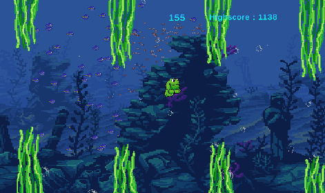

 ## Welcome to Swimmy Frog!
 ## ~ ~ ~ ~ ~ ~ ~ ~ ~ ~ ~
 ## BUILD GUIDE:

 #Step 1.
  - Download Unity. 
    Start Unity.
 
 #Step 2.
  - Clone github repo: 
    grupp3-jumpy-birb. 
 
 #Step 3.
  - Start Unity. Open project.
 
 #Step 4.
  - Press 'File' -> 'Build and Run' 
    (ctrl+B)
 
 #Step 5.
  - Open your newly built .exe file. 
    Start game.
 
 #Step 6.
  - Sell your soul to the Frog Gods...
 
 #Step 7.
  - Win!

 #This game was created by:
   -   Oliver Jensen
   -   Hampus M. Olsson
   -   Oskar Johansson
   -   David Urman

~ ~ ~ ~ ~ ~ ~ ~ ~ ~ ~ ~ ~ ~ ~ 
  
  
  
  @ Java21, Yrgo(2022)
